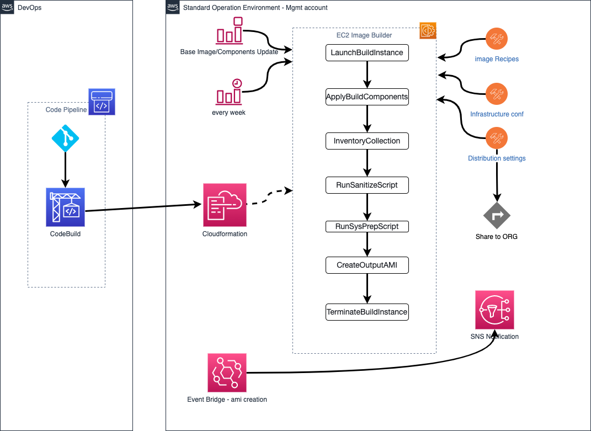

# sam-boilerplate

This is a boilerplate repo for aws sam

## Solution Overview



## Deploy Local

```bash
aws sts get-caller-identity
sam build && sam deploy
```

## Reference

https://github.com/aws-samples/ec2-imagebuilder-ami-lifecycle

https://github.com/aws-samples/ec2-imagebuilder-ami-share
